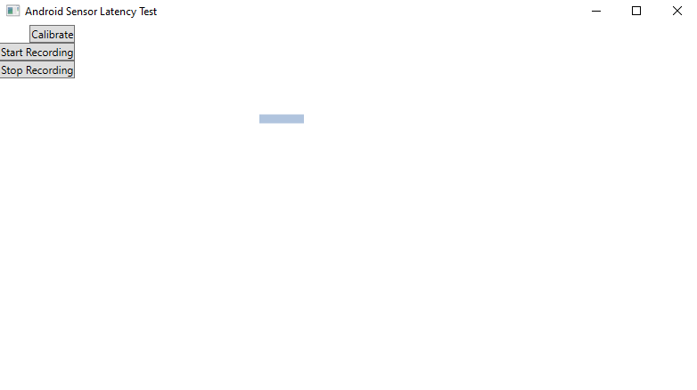

# Android Sensor Latency Test
## Overview

This app uses [the library](https://github.com/vitaliy1919/Android-Sensor-Data-Backend) to visually test the latency of the data acquired from the phone and to record the data in order to analyze the data later.

## Usage
Connect your phone to the PC and run [the app](https://github.com/vitaliy1919/Android-Sensors-Data-to-PC) (pay attention to prerequisites there). After that start this app. 

### Latency test
Lay your phone on the stable surface. Press calibrate button and start rotating your phone. The blue stick on the screen rotates according to the rotating of your phone, thus you can notice if there is a discernible lag between rotation of the phone and stick, hence estimate if the latency of sensors is useful for your purposes.

### Data recording

After you press the "Start Recording" Button the incoming data is saved to `log.txt` file in the format of `<Sensor type>, <timestamp>, <sensor data values, separator is coma>`. For instance: `Accelerometer, 8643007751041, -8.954697, 4.404648, 1.233398`. When you press "Stop Recording" recording is paused.